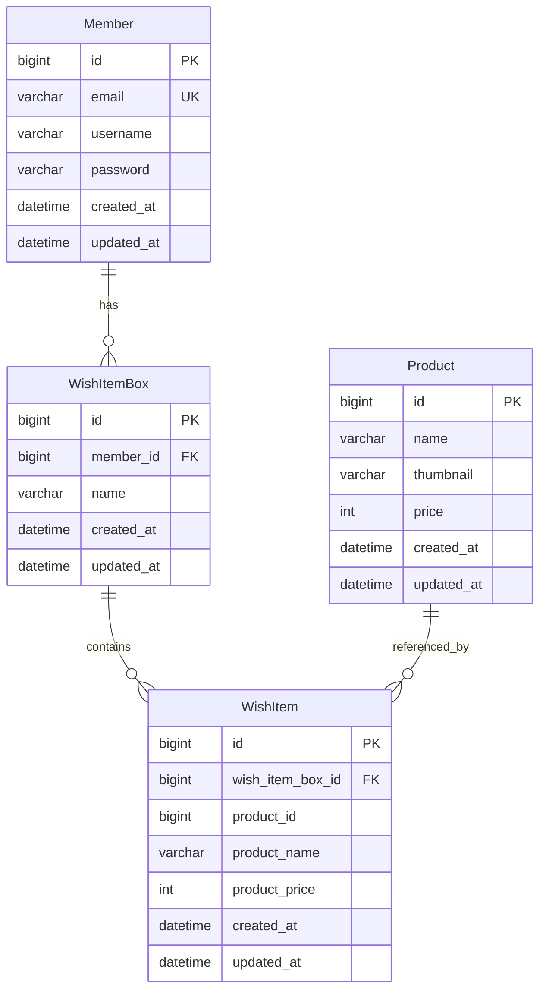

# backend-onboard-youngbin


## 🚀 실행 가이드

### 로컬 개발 환경 (SQLite)

```bash
# Install dependencies
poetry install

# Run migrations
poetry run python manage.py makemigrations
poetry run python manage.py migrate

# Start development server
poetry run python manage.py runserver
```

### Docker 환경 (MySQL)

```bash
# Build and run with auto-migration
docker-compose up --build
```

**API Server**: http://localhost:8000  
**API Documentation**: http://localhost:8000/swagger

## 📊 ERD



## 📋 기능 요구사항

### 유저 (Member)

- [X] **회원가입** 
  - [X] 사용자명, 이메일, 비밀번호로 회원가입
  - [X] 이메일 형식: `??@??.??` 패턴 검증
  - [X] 비밀번호 정책: 12자 이상, 대문자/소문자/특수문자 포함
- [X] **로그인** 
  - [X] 이메일과 비밀번호로 인증
  - [X] 토큰 발급 및 반환
- [X] **내 정보 조회** 
  - [X] 인증된 사용자 정보 조회

### 찜 서랍 (WishItemBox)

- [X] **찜 서랍 생성** - 새로운 찜 서랍 생성
- [X] **찜 서랍 삭제** - 서랍 삭제 시 포함된 찜 상품 일괄 삭제 (Cascade)
- [X] **찜 서랍 목록 조회** - 페이지네이션 또는 무한 스크롤 지원
- [X] **유니크 제약조건** - 사용자별 찜 서랍 이름 중복 불가

### 찜 (WishBox)

- [X] **상품 찜하기** - 특정 찜 서랍에 상품 추가
- [X] **찜 해제** - 찜 서랍에서 상품 삭제
- [X] **찜 목록 조회** - 페이지네이션 또는 무한 스크롤 지원
- [X] **중복 방지** - 동일 상품을 다른 찜 서랍에 중복 저장 불가
- [X] **선행 조건** - 찜 서랍이 최소 1개 이상 존재해야 상품 찜 가능

## 🛠 기술 스택

**Core**
- Python 3.11
- Django 4.1.1
- Django REST Framework 3.11.0

**Database**
- SQLite (Local)
- MySQL (Docker)
- PyMySQL

**Testing**
- pytest
- pytest-django

**DevOps**
- Docker
- Docker Compose

**Documentation**
- drf-yasg (Swagger/OpenAPI)
